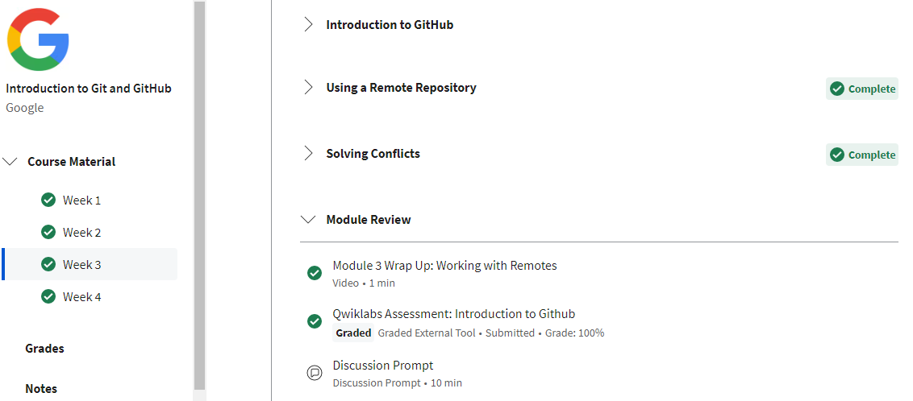
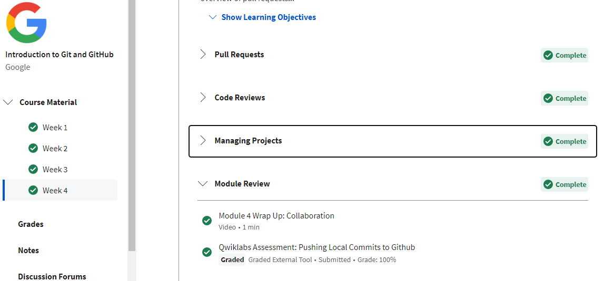
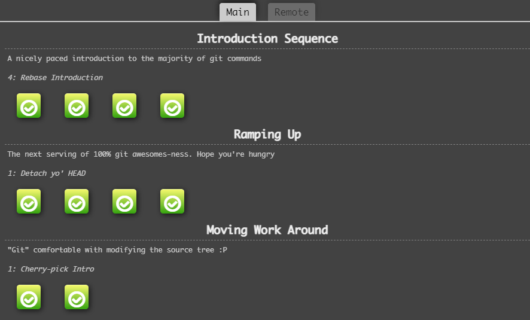
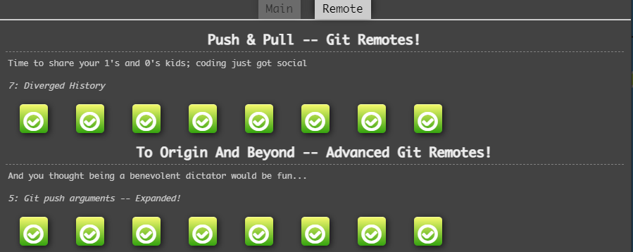
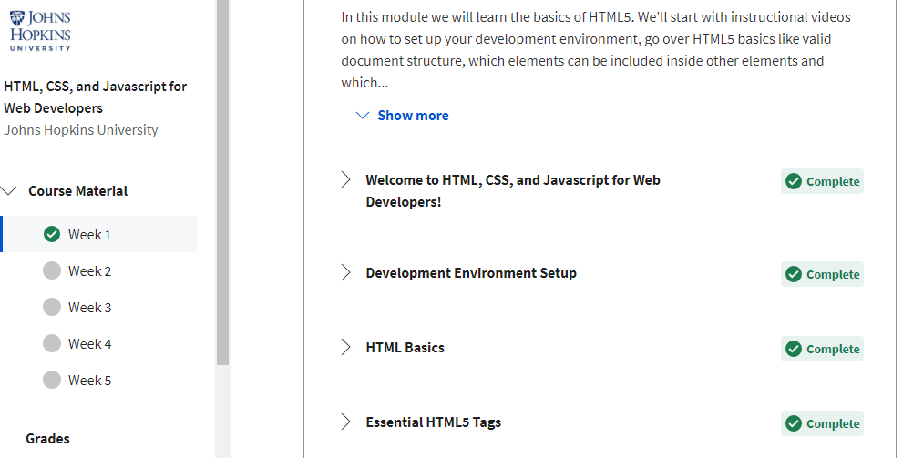
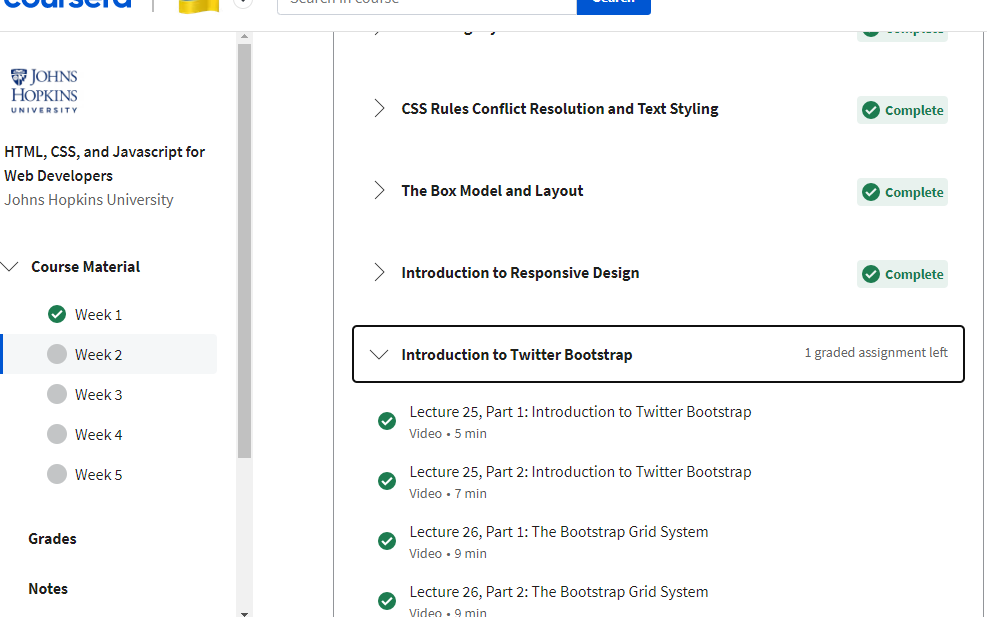
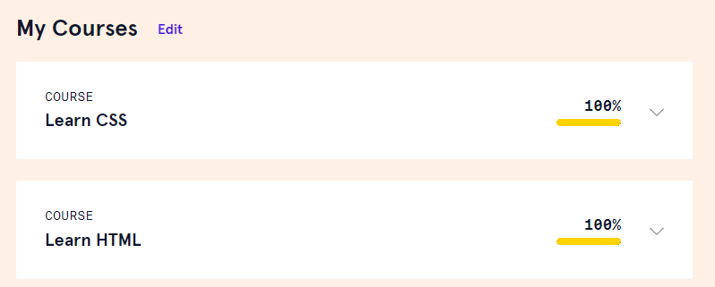
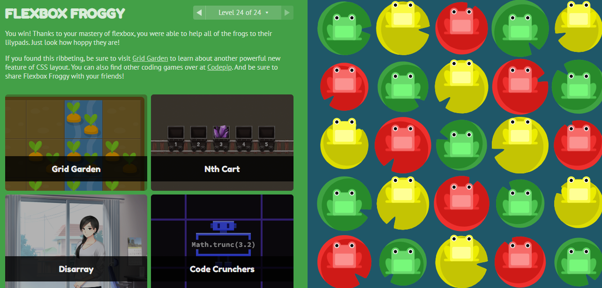
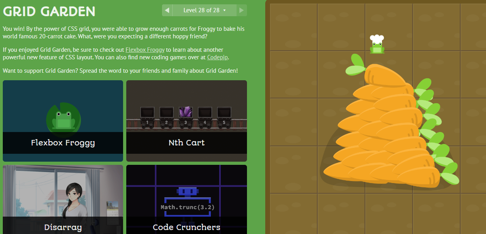

# kottans-frontend

## 0. Git Basics

Refreshed my knowledge of Git and GitHub.

## 1. Linux CLI, and HTTP

Screenshots

I already had some experience with the Ubuntu terminal before the course and just repeated some commands. I knew very little about HTTP, so almost everything described in the articles was new to me.

## 2. Git Collaboration

Screenshots

Almost everything related to Git collaboration was new to me as I used it only for personal needs before. Exercises at learngitbranching.js.org helped with understanding a lot, but I feel that I'll need to return to some of the covered topics again.

## 3. Intro to HTML and CSS

Screenshots

I knew everything from these courses, except how 'position: sticky' works.

## 4. Responsive Web Design

Screenshots

I've used flexbox before, but forgot a lot of properties, so it was really useful to refresh my knowledge. Grid was completely new to me.
