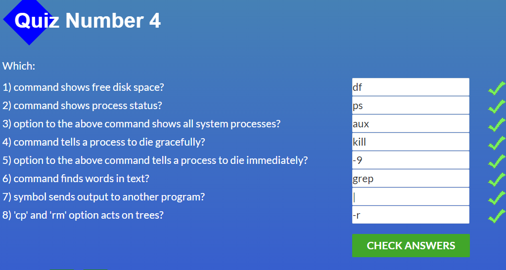

# kottans-frontend

## 0. Git Basics

Refreshed my knowledge of Git and GitHub.

## 1. Linux CLI, and HTTP

Screenshots

I already had some experience with the Ubuntu terminal before the course and just repeated some commands. I knew very little about HTTP, so almost everything described in the articles was new to me.
